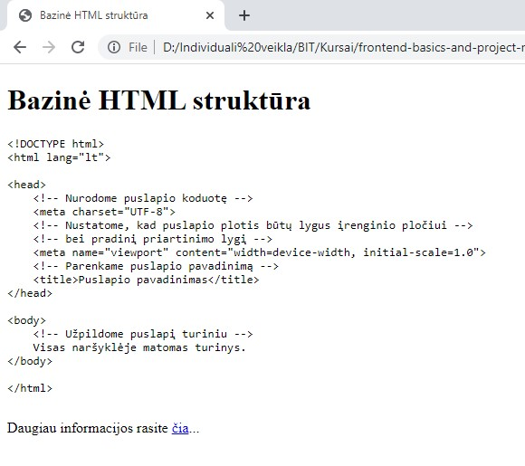

# Bazinė HTML struktūra

## Užduotis

-   Puslapyje atvaizduokite bazinę HTML struktūrą:

```txt
<!DOCTYPE html>
<html lang="lt">

<head>
    <!-- Nurodome puslapio koduotę -->
    <meta charset="UTF-8">
    <!-- Nustatome, kad puslapio plotis būtų lygus įrenginio pločiui -->
    <!-- bei pradinį priartinimo lygį -->
    <meta name="viewport" content="width=device-width, initial-scale=1.0">
    <!-- Parenkame puslapio pavadinimą -->
    <title>Puslapio pavadinimas</title>
</head>

<body>
    <!-- Užpildome puslapį turiniu -->
    Visas naršyklėje matomas turinys.
</body>

</html>
```

-   Nustatykite puslapio pavadinimas ir pateikite antraštę: "Bazinė HTML struktūra".
-   Pateikite nuorodą į informacinį šaltinį <https://stuyhsdesign.wordpress.com/basic-html/structure-html-document/>

## Rezultatas

Vaizdas naršklėje turėtų būti maždaug toks:

.

Turinys turi būti validus ir patikrintas su [HTML validatoriumi](https://validator.w3.org/#validate_by_input).
