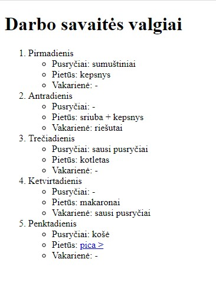
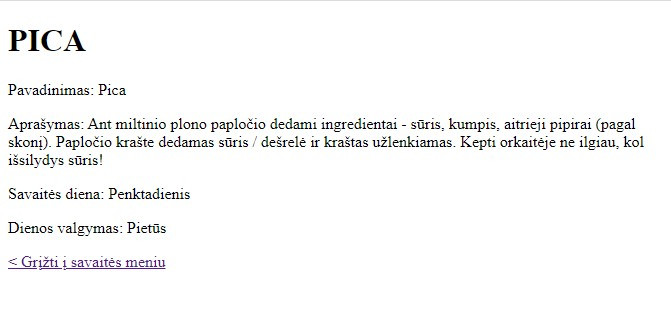

# Savaitės valgiaraštis

## 1 dalis

-   Sukurti aplanką pavadinimu "projektas-maistas";
-   Aplanke sukurti failą "valgymai.html", faile atvaizduoti atvaizduoti:
    -   visos darbo savaitės meniu sąrašą (surikiuotą);
    -   vienos dienos sąrašą (nerikiuotą)
-   Užvedus pelę ant brūkšnelio, turi rašyti "valgis praleidžiamas".
-   Paspaudus patiekalo "pica" pavadinimą, vartotojas turi būti nukreipiamas į "pica.html" puslapį.

## 2 dalis

-   Aplanke "projektas-maistas" sukurti failą “pica.html”, jame atvaizduoti:
    -   Picos pavadinimą
    -   Picos aprašymą
    -   Kurią dieną patiekiamas patiekalas
    -   Kokiam dienos valgymui priskiriamas
-   Pridėti nuorodą grįžimui į savaitės meniu.

## Rezultatas

Dvi susietos tarpusavyje puslapio dalys:

Savaitės valgymai:

.

Pica:

.

