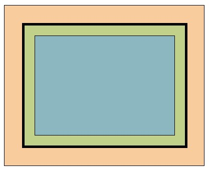

# Užduotis Box Model

Iš pateiktos informacijos suformuokite pavaizduotą modelį:

## Spalvos

-   Mėlyna - `#8cb7c0`;
-   Žalia - `#c1d18a`;
-   Oranžinė - `#f8cc9d`;
-   Juoda - `black`

## Išmatavimai

-   Mėlyna spalva
    -   Plotis - 280px
    -   Aukštis - 200px
    -   Rėmelis - 1 pikselis, vientisas, juodas
-   Žalia spalva
    -   Plotis - 330px
    -   Vidinis atitraukimas - 20px
    -   Rėmelis - 5 pikseliai, vientisas, juodas
-   Oranžinė spalva
    -   Plotis - 400px
    -   Vidinis atitraukimas - 35px
    -   Rėmelis - 1 pikselis, vientisas, juodas
    -   Išorinis atitraukimas nuo viršaus - 35px
    -   Išorins atitraukimas nuo kairės - 20px

## Nefunkciniai reikalavimai

-   Elementų box model taikykite `box-sizing` border box.
-   Stiliai rašomi atskirame faile.
-   Kaip darbo šabloną naudokite failus esančius `base` aplanke.
