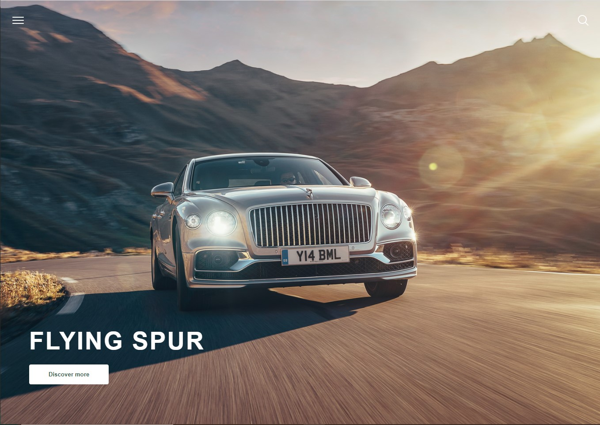
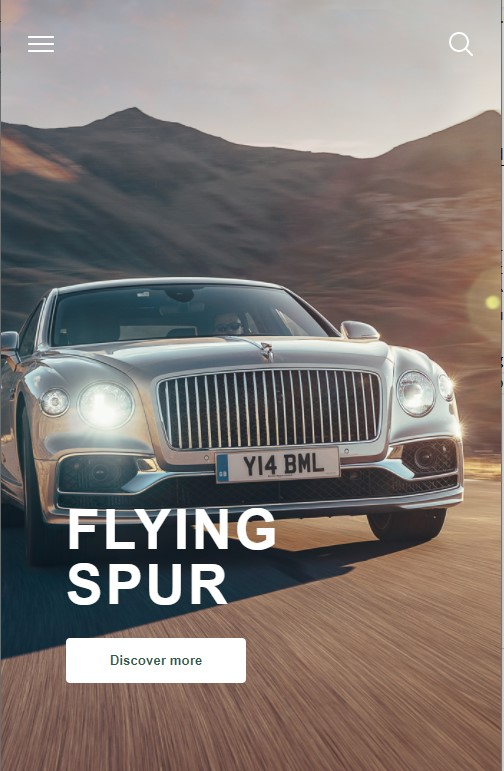

# Trumpa užduotis hero-image

Sukurkite puslapį pagal pateiktą HTML struktūrą, aprašymą ir rezultato paveikslėlį.

## Rezultatas

### Desktop / tablet

### Mobile

## Išvaizda

-   Naudokite fono paveikslėlį <https://s.aolcdn.com/os/ab/_cms/2019/10/11192400/RP-Bentley-Extreme-Silver-Flying-Spur-Monaco-48.jpg>, jį sucentruokite.
-   Paveikslėlis turi užimti visą sekciją, kuri turi užimti vieną pilną viewport zonos dydį.
-   Puslapio viršuje turi būti dvi ikonėlės - burger icon kairėje, paieškos ikonėlė dešinėje. Abi ikonėlės turi būti baltos.
-   Puslapio apačioje turi būti baltas 55px pastorintas tekstas, tarp raidžių turi būti 3px tarpas, visos raidės didžiosios.
-   Po tekstu turi būti baltos spalvos mygtukas apvalintais kraštais, teksto spalva #325b4c.
-   Užvedus pelę ant mygtuko, tekstas turi tapti baltu, o jo fonas #858585 spalvos.
-   Visas tekstas puslapyje yra `sans-serif` šrifto šeimos.
