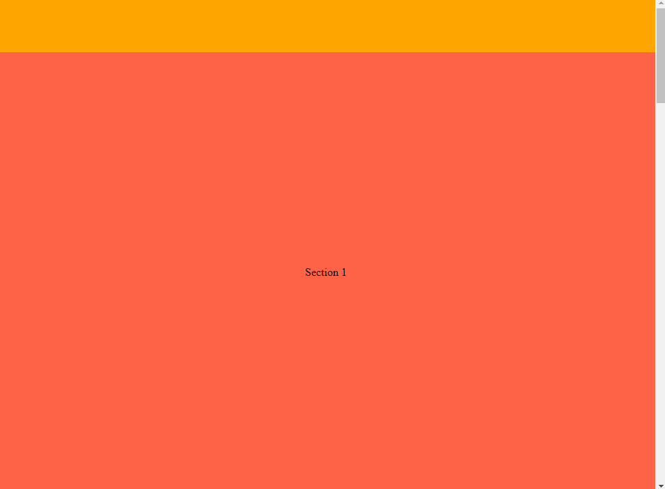

# Užduotis - landing page naudojant CSS grid

Pagal aprašymą suformuokite landing page layout'o puslapį naudojant CSS grid.

Vos atidarius puslapį atvaizduokite 80px header'į ir sekciją kuri užimtų likusią erdvę iki viewport pabaigos.
Pridėkite dar keturias sekcijas kurių dydis - vieno viewport'o aukštis.

Grid'o template'ui panaudokite `grid-template-rows` CSS property.

