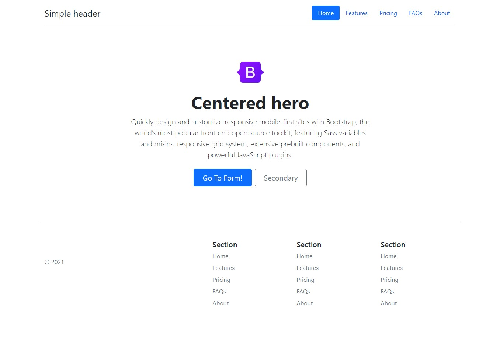
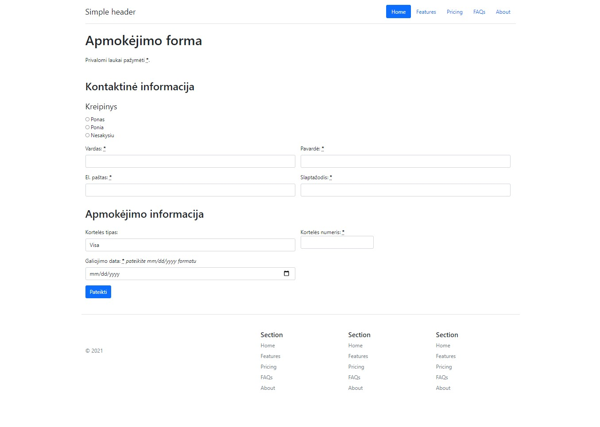

# Užduotis - Bootstrap CPDD

Naudodami Bootstrap CSS karkasą, Bootstrap pavyzdžius bei dokumentaciją sukurkite du puslapius - index.html ir form.html.

-   Puslapiai turi būti sukurti pagal pateiktas fotografijas.
-   Į bazinę HTML struktūrą importuokite Bootstrap CSS karkasą (užduočiai jums reikės tik CSS):
    -   <https://getbootstrap.com/docs/5.1/getting-started/introduction/#css>
-   Turinį (header, footer, hero section) panaudokite iš Bootstrap [pavyzdžių](https://getbootstrap.com/docs/5.1/examples/):
    -   <https://getbootstrap.com/docs/5.1/examples/headers/>
    -   <https://getbootstrap.com/docs/5.1/examples/heroes/>
    -   <https://getbootstrap.com/docs/5.1/examples/footers/>
-   `index.html` puslapio mygtukas `Go To Form!` turi nukreipti į `form.html` puslapį.
-   `form.html` puslapyje sukonstruokite apmokėjimo formą pagal užduotį [Apmokėjimo formą](../../../../3%20savaitė/3.3/assigments/apmokejimo-forma/uzduotis-apmokejims-salyga.md). Kaip pavyzdį galite panaudoti užduoties sprendimo [kodą](../../../../3%20savaitė/assigments/../3.3/assigments/apmokejimo-forma/uzduotis-apmokejimas.html).

## Naudingi šaltiniai

-   <https://getbootstrap.com/docs/5.1/forms/layout/#gutters>

## Rezultatas

-   index.html

-   form.html

\* CPDD - Copy / Paste Driven Development 😜
