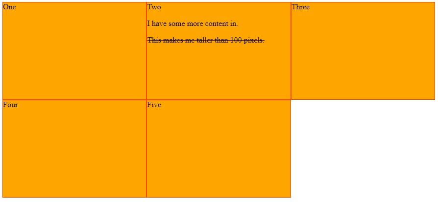
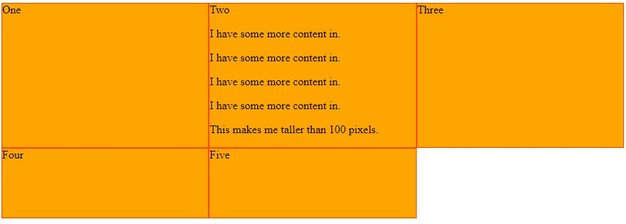
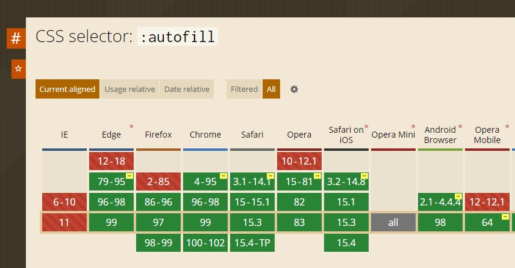
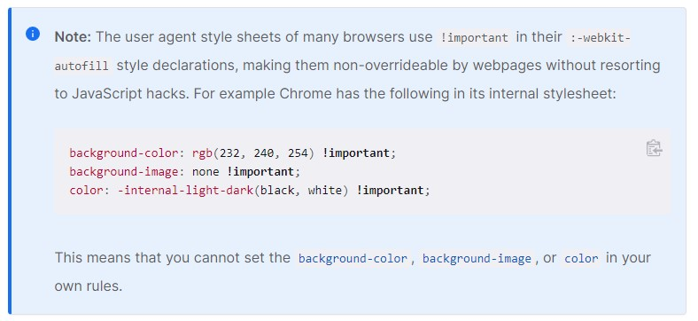
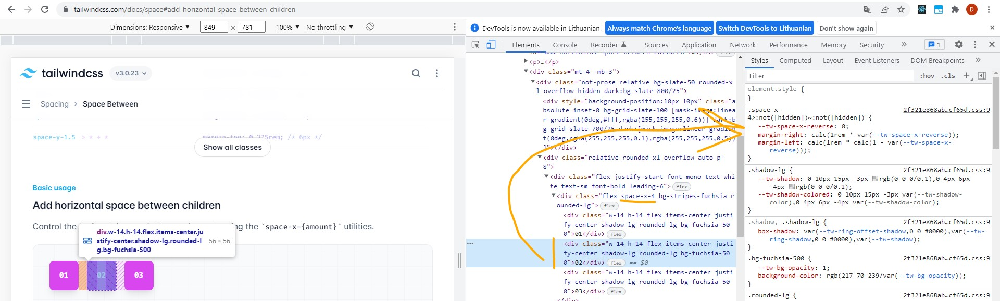

# Nepavykusių pavyzdžių skrynelė

## `position: sticky;`

Nustačius elementui `position: sticky;` jis vaizduojamas įprastai, kol jam negresia išeiti už viewport ribų.
Tuomet jis pradeda pozicionuotis pagal artimiausią protėvį, kuriame yra scroll galimybė, ir pagal artimiausią blokinį protėvį:

> The element is positioned according to the normal flow of the document, and then offset relative to its nearest scrolling ancestor and containing block (nearest block-level ancestor)<...>

MDN <https://developer.mozilla.org/en-US/docs/Web/CSS/position#values>

Pavyzdys nepavyko, nes artimiausias blokinis protėvis apribojo elementą, kuriam buvo nustatytas `position: sticky;`. **Sticky funkcionalumas pasireiškia tik šio blokinio (parent) elemento ribose.**

### Veikiantis pavyzdys

```css
.containing-box.sticky {
    height: 500px;
    padding: 50px 0px;
}

.containing-box.sticky .box {
    position: sticky;
    top: 0;
}
```


## Grid `minmax(100px, 200px);`

Grid'as, kurio menamo grid'o rows'ų aukštis yra tarp 100px ir 200px - `minmax(100px, 200px)`, su turiniu rezultate buvo 200px aukščio, o ne turinio aukščio, nes by
default grid'as bando užimti maksimaliai laisvos vietos:

> [In general, tracks will try to reach their max size:](https://www.w3.org/TR/css-grid-2/#algo-grow-tracks)
> If the free space is positive, distribute it equally to the base sizes of all tracks, freezing tracks as they reach their growth limits (and continuing to grow the unfrozen tracks as needed).

Šaltiniai: <https://stackoverflow.com/a/52377092>, <https://www.w3.org/TR/css-grid-2/#algo-grow-tracks>

Realus rezultatas:



Realaus rezultato (pavyzdžio) kodas:

```css
.wrapper {
    display: grid;
    grid-template-columns: repeat(3, 1fr);
    grid-auto-rows: minmax(100px, 200px);
}
```

Tikėtasi:



Tikėtosi rezultato kodas:

```css
.wrapper {
    display: grid;
    grid-template-columns: repeat(3, 1fr);
    grid-auto-rows: minmax(100px, min-content);
}
```

## `:autofill` pseudo klasė

Nors `:autofill` yra vis plačiau palaikoma pseudo klasė, ją MDN rekomenduoja naudoti su `:-webkit-` prefix'u.

Palaikymas:



Šaltinis: <https://caniuse.com/mdn-css_selectors_autofill>

Pseudo klasės įveiklinti nepavyko, nes demonstracijai buvo pasirinkti butent tie CSS properties, kurių naršyklės default'iniai stiliai įprastai neleidžia keisti (default stiliai naudoja !important):



Šaltinis: <https://developer.mozilla.org/en-US/docs/Web/CSS/:autofill>

Vis dėlto... Mes dar galime nustatyti outline'ą ir border'erį 😄:


Kodas:

```css
input:-webkit-autofill {
    outline: firebrick solid 20px;
    border: 35px solid green;
}
```

## Tailwind `space-x-4` paieškos

Klasė `space-x-4` buvo dedama parent elementui, o faktiškai paveikdavo dali child element'ų - antrą ir tolimesnius. Jiems uždėdavo margin.

DevTools tai rodo čia:


